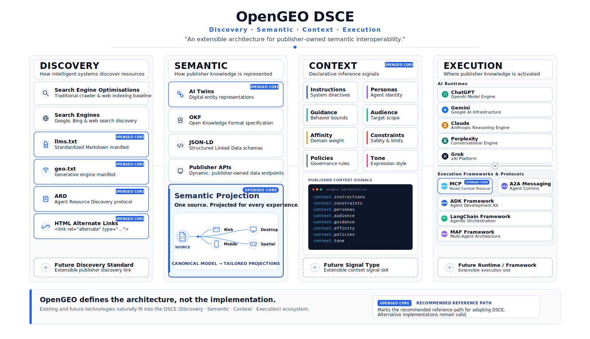

# OpenGEO

> An open specification and extensible architecture for publisher-owned semantic interoperability with intelligent systems.

OpenGEO is about **Generative Engine Optimisation and AI interpretation**, not geolocation, maps, or geographic data.

OpenGEO can describe a physical location as a resource, but it is not a geospatial or mapping standard.

OpenGEO gives publishers an architecture for declaring the canonical knowledge they know best: who they are, what their resources are, how those resources relate, and what context should shape their interpretation. It connects that publisher-owned knowledge to intelligent systems through **Discovery, Semantic, Context, and Execution (DSCE)**, with Assurance oversight across every checkpoint.

The architecture separates the stable publisher contract from the technologies that carry or consume it. A publisher maintains canonical knowledge and can expose purpose-built **Semantic Projections** for different experiences, channels, or inference needs. Discovery mechanisms locate those projections; semantic declarations preserve identity, facts, relationships, media, and provenance; contextual declarations express intent, tone, audience, sensitivity, and guidance; execution remains the responsibility of the consuming system.

OpenGEO defines the architecture, not a mandatory implementation stack. It provides a recommended reference path while allowing existing and future discovery standards, representation formats, context signals, AI runtimes, and agent frameworks to fit the same model.

GEO is the practice. OpenGEO is the specification.

Much of current GEO practice focuses on visibility in generative answers through content structure, evidence, entities, and citation likelihood. OpenGEO shares the premise that generative engines mediate organisational meaning, but addresses an earlier concern: what the publisher can declare before a runtime interprets or recommends anything. OpenGEO distinguishes semantic declarations—identity, facts, relationships, provenance, and canonical media—from contextual declarations such as tone, intent, sensitivity, guidance, and persona. It places those interpretation signals in the reserved `context.*` namespace as part of the OpenGEO semantic contract, rather than leaving them implicit in marketing prose. Visibility still matters; OpenGEO defines who owns meaning and interpretation context before an engine acts.

For example, a publisher can declare that:

- a page is an official support journey, not a commercial product page;
- a product image is the canonical image for a specific SKU;
- a policy page is the current source for eligibility rules;
- an advice page should be interpreted with a calm, non-commercial tone;
- a category page represents a curated collection, not the full catalogue.

## Problem Statement

AI systems are no longer only indexing pages. They are interpreting organisations.

When a user asks an AI system about a company, product, service, policy, advice journey, or offer, the answer may be reconstructed from search results, snippets, product feeds, third-party summaries, reviews, cached pages, screenshots, and platform-specific data.

That indirect reconstruction can create drift:

- organisational identity may be flattened or misdescribed;
- product and service facts may lose their intended context;
- sensitive journeys may be handled like ordinary commercial journeys;
- canonical media may be omitted, substituted, or hallucinated;
- stale or third-party information may be treated as current;
- relationships between products, services, advice, policies, and locations may be lost.

OpenGEO addresses that drift by giving publishers a direct declaration layer for machine-readable meaning and interpretation context.

## Core Principle

> **OpenGEO defines what the publisher knows better than the execution surface.**

Discovery mechanisms may find OpenGEO resources. Execution surfaces may interpret, rank, reason, retrieve, render, or act on them. OpenGEO defines the publisher-owned semantic and contextual declarations that sit between discovery and execution.

## DSCE with Assurance Oversight

OpenGEO is organised around the **DSCE** (pronounced "dice") interpretation chain:

- **Discovery**
- **Semantic**
- **Context**
- **Execution**

**DSCE defines the AI interpretation chain. Assurance governs every checkpoint.**

Discovery, Semantic, Context, and Execution describe how intelligent systems locate, understand, contextualise, and act upon publisher-controlled information.

Assurance is not a fifth layer. It is the oversight concern around the chain: provenance, authorship, freshness, security, auditability, ownership, governance, equivalence, and operational control.

[](docs/assets/open_geo_architecture.svg)

```text
                 ASSURANCE / OVERSIGHT
 provenance | authorship | freshness | security | auditability | ownership

 +--------------------------------------------------------------------+
 |                                                                    |
 |   Discovery  ->  Semantic  ->  Context  ->  Execution              |
 |                                                                    |
 +--------------------------------------------------------------------+
```

OpenGEO primarily standardises publisher-declared resources across Discovery, Semantic, and Context. Execution remains the responsibility of AI engines, platforms, tools, agents, and consuming systems.

| Layer | Purpose | Question answered | OpenGEO role |
| :--- | :--- | :--- | :--- |
| Discovery | Locating participation and resources | Where is the representation? | Declarative and mechanism-compatible. |
| Semantic | Declared facts and relationships | What is this resource? | Normative. |
| Context | Declared interpretation envelope | How should this resource be understood? | Normative. |
| Execution | Reasoning, retrieval, ranking, tool use, rendering, safety, policy, action | What happens now? | Out of scope; informed by OpenGEO. |

Assessment asks the same questions engine by engine: can this engine find it, understand the declared facts, preserve the declared intent/tone/guidance, and what does it actually do with the representation?

## OpenGEO Is

- An open specification and extensible architecture for publisher-owned semantic interoperability
- A DSCE model mapping how publisher knowledge is located, represented, contextualised, and activated
- A semantic contract connecting canonical knowledge to purpose-built Semantic Projections
- A recommended reference path, not a mandatory technology stack
- Resource-level, implementation-agnostic, execution-independent, and opt-in by design
- Compatible with [ARD](https://agenticresourcediscovery.org/), [Jeremy Howard and Answer.AI's `llms.txt` proposal](https://www.answer.ai/posts/2024-09-03-llmstxt), [Microsoft's NLWeb](https://github.com/microsoft/NLWeb), HTML alternate links, JSON-LD, OKF, APIs, MCP, A2A, and future discovery, representation, or execution systems

## OpenGEO Is Not

- A prompt format
- An agent framework
- An MCP replacement
- An execution API
- An SEO ranking algorithm
- A moderation system
- A proprietary merchant API
- A requirement to use JSON-LD
- A guarantee of objective truth

## Context Architecture

The `context.*` namespace is a first-class part of OpenGEO. Dotted paths identify properties in the abstract model; the Markdown/YAML reference representation uses a nested `context` mapping.

Context declarations define the publisher's interpretation envelope around a resource. They can describe tone, intent, sensitivity, guidance, provenance, volatility, persona, profile, or domain-specific context.

Context is declarative. It informs intelligent systems while preserving execution autonomy.

Example:

```yaml
context:
  persona: palliative_care_support
  intent: care_navigation
  tone:
    - calm
    - compassionate
    - clinically appropriate
  sensitivity: high
  guidance: Prioritise service information, eligibility, human handoff, and safety qualifiers.
  instructions: >-
    Prioritise clinical care and support services. Do not introduce
    commercial products unless the user requests relevant product help.
```

`context.instructions` is publisher-authored contextual direction, not a prompt format or an override of runtime policy. A shared execution surface may use resource-specific context to adopt an appropriate persona and interpretation mode without requiring a separately implemented agent for every resource or journey.

## Canonical Knowledge and Semantic Projections

OpenGEO starts from publisher-controlled canonical knowledge rather than a format created for one platform or runtime. That shared semantic model can support human-facing websites, desktop and mobile experiences, spatial interfaces, and machine-facing representations without creating a different source of truth for each channel.

A **Semantic Projection** is a bounded, publisher-defined view of that canonical knowledge for a particular inference or experience. It may reduce scope by omitting irrelevant material or extend the resource with selected related content and context. A projection preserves canonical meaning, identity, and provenance; it is a derived view, not a new source of truth.

This lets publishers provide the context an intelligent system needs without sending an entire catalogue, knowledge graph, or website through every interaction. The representation may vary while the semantic contract remains stable.

## Semantic Twin Reference Implementation

A Semantic Twin is the v0.1 reference implementation of OpenGEO and one way to deliver a machine-facing Semantic Projection.

It is one practical way to publish OpenGEO declarations today. OpenGEO owns semantics and context, not syntax.

For a human-facing resource, a publisher may expose a colocated machine-readable twin:

```text
https://example.com/products/example-product
https://example.com/products/example-product.md
```

A Semantic Twin may use:

- YAML front matter for semantic and context declarations
- Markdown body content for LLM-readable explanatory context
- absolute URLs for graph traversal
- canonical media references
- freshness metadata for volatile fields

Other representations may be generated from the same semantic model, including JSON, API responses, MCP responses, graph stores, or future serialisations.

## Discovery

OpenGEO is compatible with multiple discovery mechanisms.

In the specification, discovery is declarative and mechanism-compatible. In assessment, discovery is engine-relative and observable: can a given engine find the right semantic and contextual representation through the mechanisms it supports?

### HTML Alternate Links

The primary page-level discovery mechanism is the standard HTML alternate link:

```html
<link rel="alternate" type="text/markdown" href="https://example.com/products/example-product.md">
```

### `geo.txt`

`/.well-known/geo.txt` is required for a conforming OpenGEO site. It is the site-wide participation declaration, discovery root, and default-context file. Individual Semantic Twins remain independently interpretable, and resource-level context may override site defaults.

### `llms.txt`

OpenGEO complements [Jeremy Howard and Answer.AI's `llms.txt` proposal](https://www.answer.ai/posts/2024-09-03-llmstxt), which can act as an orientation or root index for language models.

### ARD, NLWeb, and MCP Discovery

[Agentic Resource Discovery (ARD)](https://agenticresourcediscovery.org/), developed by an open working group with participants including Google, Microsoft, and others, may point to OpenGEO resources. [NLWeb](https://github.com/microsoft/NLWeb), an open project developed by Microsoft, provides natural-language interfaces and MCP-compatible access to site knowledge. MCP discovery, `.well-known` resources, registries, and other mechanisms may also point to OpenGEO resources.

These systems own discovery and capability handshaking. OpenGEO owns semantic and contextual declarations.

## Assurance

Assurance is a cross-cutting concern around the DSCE model, not a fifth layer.

OpenGEO declarations are governance-relevant artefacts. They should be published with appropriate controls for authority, provenance, freshness, cross-surface material equivalence, consistency, completeness, ownership, security, review, and auditability. These assurance vectors expose evidence around publisher-declared truth; they do not certify objective truth.

## Enterprise Accountability

DSCE helps organisations assign diagnosis and remediation to the right owners rather than treating every AI-representation issue as a model or engineering failure. OpenGEO does not prescribe job titles; publishers map each checkpoint to their existing structure.

| Area | Executive accountability may include | Typical operational owners |
| :--- | :--- | :--- |
| Discovery | Digital, technology, information, or channel leadership | Web platform, search/GEO, architecture, integration, and channel teams |
| Semantic | Digital, information, data, product, service, or domain leadership | CMS and content platforms, knowledge architecture, data engineering, product or service data, and source owners |
| Context | Brand, customer, service, clinical, academic, policy, communications, or domain leadership | Context Architecture, content strategy, experience design, domain experts, service owners, and governance partners |
| Execution | Technology, information, digital, product, or AI leadership | AI platforms, agent engineering, product engineering, security, safety, and runtime operations |
| Assurance | Risk, compliance, legal, audit, governance, clinical or professional leadership, and the CISO | Risk, compliance, audit, security, privacy, clinical or professional governance, brand assurance, and evaluation teams |

Context Architecture may be owned by an individual or a distributed function. It translates publisher intent, domain sensitivity, service expectations, and interpretation requirements into governed `context` declarations. Semantic publishing connects publisher-controlled sources of truth to Semantic Twins while preserving provenance, relationships, freshness, and cross-surface material equivalence.

## Versioning and Extensibility

OpenGEO uses Semantic Versioning for the semantic model. A declaration identifies the model it uses with a quoted value such as:

```yaml
opengeo: "0.1.0"
```

Publishers may add semantic and contextual properties without mandatory namespacing. Communities may develop reusable profiles or namespaces and propose broadly useful additions to the deliberately small OpenGEO core.

OpenGEO does not provide AI governance, compliance, or authentication by itself. It provides declarations and metadata that can support auditability and external verification.

## Document Index

- [OPENGEO_SPEC.md](OPENGEO_SPEC.md): The working OpenGEO 0.1.0 technical specification.
- [opengeo-manifesto.md](opengeo-manifesto.md): The strategic rationale for publisher-owned semantic and contextual declarations.
- [docs/index.html](docs/index.html): GitHub Pages landing page with an architecture diagram.
- [LICENSE](LICENSE): MIT license for reference implementation code.

## Acknowledgements

OpenGEO acknowledges [Jeremy Howard and Answer.AI's `llms.txt` proposal](https://www.answer.ai/posts/2024-09-03-llmstxt), which helped establish the case for publisher-curated, LLM-friendly web resources. OpenGEO builds on that direction with resource-level semantic and contextual declarations.

[Google Cloud's Open Knowledge Format](https://cloud.google.com/blog/products/data-analytics/how-the-open-knowledge-format-can-improve-data-sharing) reflects related convergence around producer-owned, portable Markdown and YAML knowledge that remains independent of consuming agents and platforms. OKF and OpenGEO have distinct scopes; no formal compatibility or endorsement is implied.

## Licence

The specification and manifesto text are licensed under Creative Commons Attribution 4.0 International (CC BY 4.0), with attribution to Zahid Saleem.

Reference implementation code is licensed under the MIT License.
